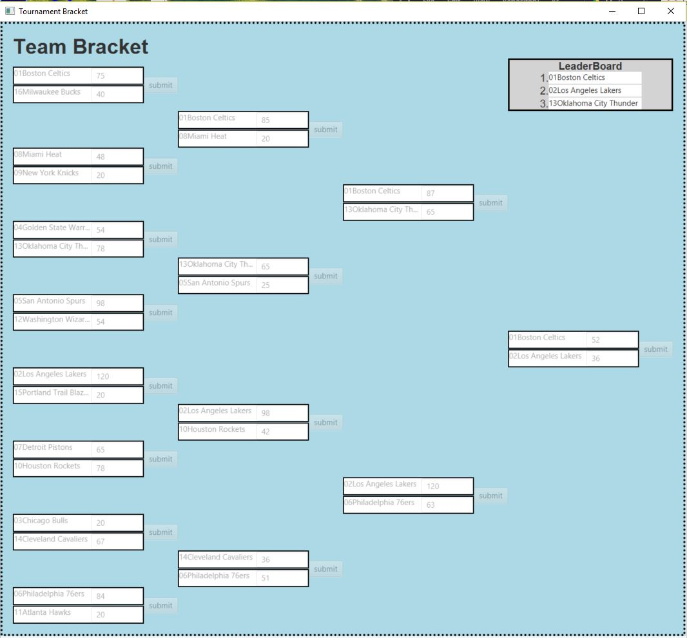

# Tournament Bracket
A Program that create a bracket from a list of teams. The user can determine who determines which team advance to the next round by inputting the score. Once the final match is played the tournament winner, runner-up, and third-place will be displayed.

 
